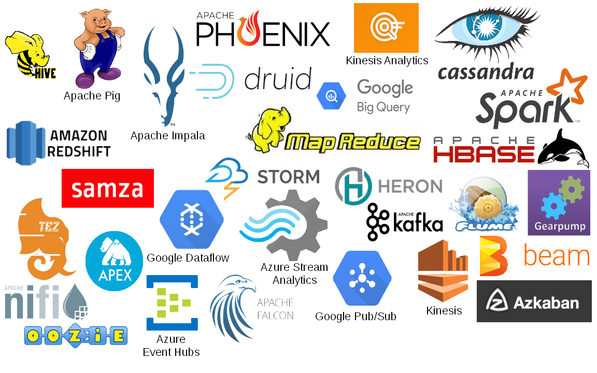
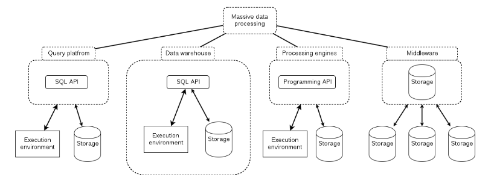
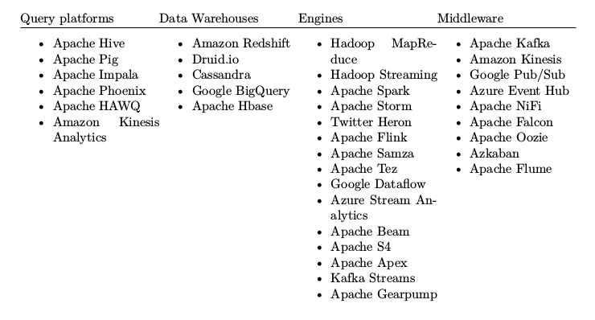
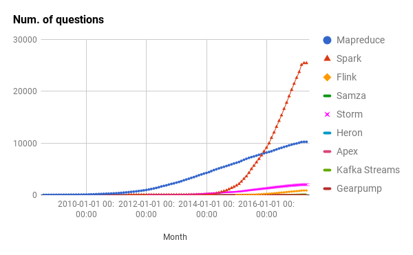
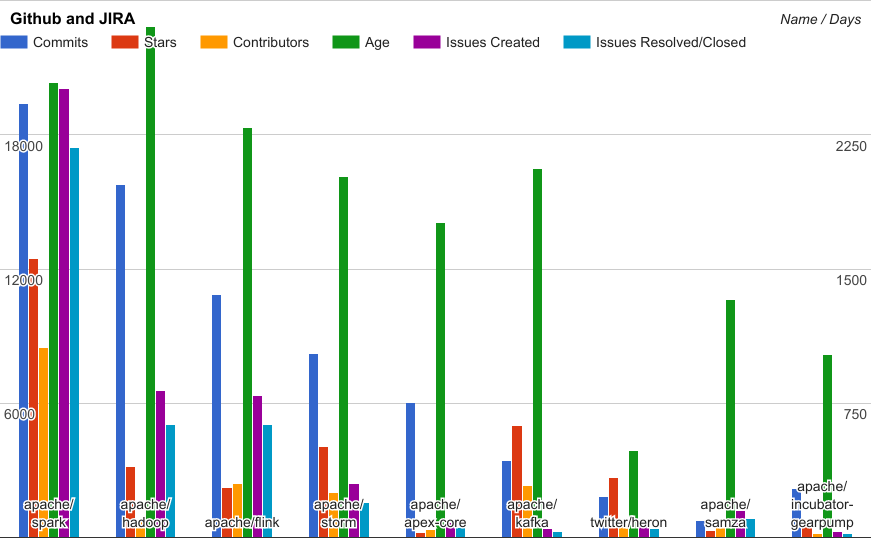

## Why do we need 9 different data processing engines?

### And what makes Spark 2.32x better than Flink?

<span style="color:gray; font-size:0.6em;">Wojciech Pituła @ Nordea Common Platforms</span>


----

## What is it all about?

++++

### After a year with spark ...

++++


++++


++++


++++



++++

> Comparison of modern platforms for massive data processing

----

## Overview

++++


notes:
one or two more than spark
this slides took me 3 hours
each logo has a name somewhere near it

++++

### Classification



++++

### Classification



----

## What to compare ?

* Actively maintained
* Open-source

++++

## Batch vs Stream 

<table>
  <tbody>
    <tr>
      <th>Batch</th>
      <th>Stream</th>
    </tr>
    <tr>
      <td valign="top" style="vertical-align: top">
        <ul>
          <li>Hadoop MapReduce</li>
          <li>Apache Spark</li>
          <li>Apache Flink</li>
          <li><span style="color: grey">Apache Apex</span></li>
        </ul>
      </td>
      <td>
        <ul>
          <li>Apache Spark</li>
          <li>Apache Flink</li>
          <li>Apache Apex</li>
          <li>Apache Storm</li>
          <li>Twitter Heron</li>
          <li>Apache Samza</li>
          <li>Kafka Streams</li>
          <li><span style="color: grey">Apache Gearpump</span></li>
        </ul>
      </td>
    </tr>
  </tbody>
</table>

----

## APIs

++++

### Processors vs DSL

++++

#### Processor

```java
public static class SplitSentence extends BaseBasicBolt {

    @Override
    public void execute(Tuple input, BasicOutputCollector collector) {
        String[] split = input.getString(0).split("[\\s]+");
        for (String word : split) {
            collector.emit(Arrays.asList(word));
        }
    }

    @Override
    public void declareOutputFields(OutputFieldsDeclarer declarer) {
        declarer.declare(new Fields("word"));
    }
}
```

++++

#### Processors composition

```java
TopologyBuilder builder = new TopologyBuilder();
builder.setSpout("spout", kafkaSpout, 5);
builder.setBolt("split", new SplitSentence(), 8)
        .shuffleGrouping("spout");
builder.setBolt("count", new WordCount(), 12)
        .fieldsGrouping("split", new Fields("word"));
```

++++

#### DSL

```scala
val sc = new SparkContext(conf)

sc.textFile(args(0))
  .flatMap(_.split(' '))
  .map(t => (t,1))
  .reduceByKey(_+_)
```

++++

#### Processors vs DSL

<div style="zoom: 0.7">
<table>
  <tbody>
    <tr>
      <th align="left" ></th>
      <th align="center">Processors</th>
      <th align="center">DSL</th>
    </tr>
    <tr>
      <th align="left" >MapReduce</th>
      <td align="center"><span style="color:green">&#x2611;</span></td>
      <td align="center"><span style="color:red">&#x2612;</span></td>
    </tr>
    <tr>
      <th align="left" >Apache Samza</th>
      <td align="center"><span style="color:green">&#x2611;</span></td>
      <td align="center"><span style="color:red">&#x2612;</span></td>
    </tr>
    <tr>
      <th align="left" >Apache Spark</th>
      <td align="center"><span style="color:red">&#x2612;</span></td>
      <td align="center"><span style="color:green">&#x2611;</span></td>
    </tr>
    <tr>
      <th align="left" >Apache Flink</th>
      <td align="center"><span style="color:red">&#x2612;</span></td>
      <td align="center"><span style="color:green">&#x2611;</span></td>
    </tr>
    <tr>
      <th align="left" >Kafka Streams</th>
      <td align="center"><span style="color:green">&#x2611;</span></td>
      <td align="center"><span style="color:green">&#x2611;</span></td>
    </tr>
    <tr>
      <th align="left" >Apache Gearpump</th>
      <td align="center"><span style="color:green">&#x2611;</span></td>
      <td align="center"><span style="color:green">&#x2611;</span></td>
    </tr>
    <tr>
      <th align="left" >Apache Storm</th>
      <td align="center"><span style="color:green">&#x2611;</span></td>
      <td align="center"><span style="color:green">&#x2611;</span></td>
    </tr>
    <tr>
      <th align="left" >Twitter Heron</th>
      <td align="center"><span style="color:green">&#x2611;</span></td>
      <td align="center"><span style="color:red">&#x2612;</span></td>
    </tr>
    <tr>
      <th align="left" >Apache Apex</th>
      <td align="center"><span style="color:green">&#x2611;</span></td>
      <td align="center"><span style="color:red">&#x2612;</span></td>
    </tr>
  </tbody>
</table>
</div>

++++

## Languages

++++

### Languages

<div style="zoom: 0.7">
<table>
  <tbody>
    <tr>
      <th align="left" ></th>
      <th align="center">Java</th>
      <th align="center">Scala</th>
      <th align="center">Other</th>
    </tr>
    <tr>
      <th align="left" >MapReduce</th>
      <td align="center"><span style="color:green">&#x2611;</span></td>
      <td align="center"><span style="color:red">&#x2612;</span></td>
      <td align="center">Any, via Hadoop Streaming</td>
    </tr>
    <tr>
      <th align="left" >Apache Samza</th>
      <td align="center"><span style="color:green">&#x2611;</span></td>
      <td align="center"><span style="color:red">&#x2612;</span></td>
      <td align="center"></td>
    </tr>
    <tr>
      <th align="left" >Apache Spark</th>
      <td align="center"><span style="color:green">&#x2611;</span></td>
      <td align="center"><span style="color:green">&#x2611;</span></td>
      <td align="center">Python, R</td>
    </tr>
    <tr>
      <th align="left" >Apache Flink</th>
      <td align="center"><span style="color:green">&#x2611;</span></td>
      <td align="center"><span style="color:green">&#x2611;</span></td>
      <td align="center"></td>
    </tr>
    <tr>
      <th align="left" >Kafka Streams</th>
      <td align="center"><span style="color:green">&#x2611;</span></td>
      <td align="center"><span style="color:red">&#x2612;</span></td>
      <td align="center"></td>
    </tr>
    <tr>
      <th align="left" >Apache Gearpump</th>
      <td align="center"><span style="color:green">&#x2611;</span></td>
      <td align="center"><span style="color:green">&#x2611;</span></td>
      <td align="center"></td>
    </tr>
    <tr>
      <th align="left" >Apache Storm</th>
      <td align="center"><span style="color:green">&#x2611;</span></td>
      <td align="center"><span style="color:red">&#x2612;</span></td>
      <td align="center"></td>
    </tr>
    <tr>
      <th align="left" >Twitter Heron</th>
      <td align="center"><span style="color:green">&#x2611;</span></td>
      <td align="center"><span style="color:red">&#x2612;</span></td>
      <td align="center"></td>
    </tr>
    <tr>
      <th align="left" >Apache Apex</th>
      <td align="center"><span style="color:green">&#x2611;</span></td>
      <td align="center"><span style="color:red">&#x2612;</span></td>
      <td align="center"></td>
    </tr>
  </tbody>
</table>
</div>

++++

### Type-safety

++++

#### Not type-safe

<pre><code data-trim data-noescape>
public void execute(Tuple input, BasicOutputCollector collector) {
        String[] split = <mark>input.getString(0)</mark>.split("[\\s]+");
        for (String word : split) {
            collector.emit(Arrays.asList(word));
        }
    }
</code></pre>

++++

#### Type-safe

```scala
val ints: RDD[Int] = ???
val intsPlus2: RDD[Int] = ints.map(_ + 2)
val strings: RDD[String] = intsPlus2.map(_.toString)
```

++++

#### Safe vs unsafe

<div style="zoom: 0.7">
<table>
  <tbody>
    <tr>
      <th align="left" ></th>
      <th align="center">Type-safe</th>
    </tr>
    <tr>
      <th align="left" >MapReduce</th>
      <td align="center"><span style="color:green">&#x2611;</span></td>
    </tr>
    <tr>
      <th align="left" >Apache Samza</th>
      <td align="center"><span style="color:red">&#x2612;</span></td>
    </tr>
    <tr>
      <th align="left" >Apache Spark</th>
      <td align="center"><span style="color:green">&#x2611;</span></td>
    </tr>
    <tr>
      <th align="left" >Apache Flink</th>
      <td align="center"><span style="color:green">&#x2611;</span></td>
    </tr>
    <tr>
      <th align="left" >Kafka Streams</th>
      <td align="center">
        <span style="color:green">&#x2611;</span>
      </td>
    </tr>
    <tr>
      <th align="left" >Apache Gearpump</th>
      <td align="center">
        <span style="color:green">&#x2611;</span>
        <span style="color:red">&#x2612;</span>
      </td>
    </tr>
    <tr>
      <th align="left" >Apache Storm</th>
      <td align="center"><span style="color:red">&#x2612;</span></td>
    </tr>
    <tr>
      <th align="left" >Twitter Heron</th>
      <td align="center"><span style="color:red">&#x2612;</span></td>
    </tr>
    <tr>
      <th align="left" >Apache Apex</th>
      <td align="center"><span style="color:green">&#x2611;</span></td>
    </tr>
  </tbody>
</table>
</div>

++++

### Other APIs

<dl>
  <dt>Cascading</dt>
  <dd><small>Weakly-typed processor-based Java API for MapReduce</small></dd>
  <dt>Scalding</dt>
  <dd><small>Strongly-typed DSL Scala API based on Cascading</small></dd>
  <dt>Apache Beam</dt>
  <dd><small>Strongly-typed DSL-based Java and Python API for Apache Spark, Apache Flink, Apache Apex, Google Dataflow</small></dd>
  <dt>Apache Crunch</dt>
  <dd><small>Strongly typed DSL-based Java ans Scala API running on top of MapReduce and Apache Spark</small></dd>
</dl>

<!--- 15 min -->

----

## Message Delivery Guarantees

++++


++++

### Guarantees

- at-least-once
- at-most-once
- exactly-once

++++

### Problems

- ill-defined
- hard to verify

----

## Deployment

++++

### Deployment

* Local
* Yarn
* Mesos
* Standalone

++++

### Deployment

<div style="zoom: 0.7">
<table>
  <tbody>
    <tr>
      <th align="left" ></th>
      <th align="center">Local</th>
      <th align="center">Yarn</th>
      <th align="center">Mesos</th>
      <th align="center">Standalone</th>
      <th align="center">Any/None</th>
    </tr>
    <tr>
      <th align="left" >MapReduce</th>
      <td align="center"><span style="color:green">&#x2611;</span></td>
      <td align="center"><span style="color:green">&#x2611;</span></td>
      <td align="center"><span style="color:red">&#x2612;</span></td>
      <td align="center"><span style="color:red">&#x2612;</span></td>
      <td align="center"><span style="color:red">&#x2612;</span></td>
    </tr>
    <tr>
      <th align="left" >Apache Samza</th>
      <td align="center"><span style="color:green">&#x2611;</span></td>
      <td align="center"><span style="color:green">&#x2611;</span></td>
      <td align="center"><span style="color:red">&#x2612;</span></td>
      <td align="center"><span style="color:red">&#x2612;</span></td>
      <td align="center"><span style="color:red">&#x2612;</span></td>
    </tr>
    <tr>
      <th align="left" >Apache Apex</th>
      <td align="center"><span style="color:green">&#x2611;</span></td>
      <td align="center"><span style="color:green">&#x2611;</span></td>
      <td align="center"><span style="color:red">&#x2612;</span></td>
      <td align="center"><span style="color:red">&#x2612;</span></td>
      <td align="center"><span style="color:red">&#x2612;</span></td>
    </tr>
    <tr>
      <th align="left" >Apache Storm</th>
      <td align="center"><span style="color:green">&#x2611;</span></td>
      <td align="center"><span style="color:red">&#x2612;</span></td>
      <td align="center"><span style="color:red">&#x2612;</span></td>
      <td align="center"><span style="color:green">&#x2611;</span></td>
      <td align="center"><span style="color:red">&#x2612;</span></td>
    </tr>
    <tr>
      <th align="left" >Twitter Heron</th>
      <td align="center"><span style="color:green">&#x2611;</span></td>
      <td align="center"><span style="color:green">&#x2611;</span></td>
      <td align="center"><span style="color:green">&#x2611;</span></td>
      <td align="center"><span style="color:red">&#x2612;</span></td>
      <td align="center"><span style="color:red">&#x2612;</span></td>
    </tr>
    <tr>
      <th align="left" >Apache Gearpump</th>
      <td align="center"><span style="color:green">&#x2611;</span></td>
      <td align="center"><span style="color:green">&#x2611;</span></td>
      <td align="center"><span style="color:red">&#x2612;</span></td>
      <td align="center"><span style="color:green">&#x2611;</span></td>
      <td align="center"><span style="color:red">&#x2612;</span></td>
    </tr>
    <tr>
      <th align="left" >Apache Spark</th>
      <td align="center"><span style="color:green">&#x2611;</span></td>
      <td align="center"><span style="color:green">&#x2611;</span></td>
      <td align="center"><span style="color:green">&#x2611;</span></td>
      <td align="center"><span style="color:green">&#x2611;</span></td>
      <td align="center"><span style="color:red">&#x2612;</span></td>
    </tr>
    <tr>
      <th align="left" >Apache Flink</th>
      <td align="center"><span style="color:green">&#x2611;</span></td>
      <td align="center"><span style="color:green">&#x2611;</span></td>
      <td align="center"><span style="color:green">&#x2611;</span></td>
      <td align="center"><span style="color:green">&#x2611;</span></td>
      <td align="center"><span style="color:red">&#x2612;</span></td>
    </tr>
    <tr>
      <th align="left" >Kafka Streams</th>
      <td align="center"><span style="color:gold">&#x2611;</span></td>
      <td align="center"><span style="color:gold">&#x2611;</span></td>
      <td align="center"><span style="color:gold">&#x2611;</span></td>
      <td align="center"><span style="color:gold">&#x2611;</span></td>
      <td align="center"><span style="color:green">&#x2611;</span></td>
      </td>
    </tr>
  </tbody>
</table>
</div>

<!--- 6 min -->

----

## Popularity

Maturity

++++



++++



----

## Enterprise support

++++

# Enterprise support

<div style="zoom: 0.7">
<table>
  <tbody>
    <tr>
      <th align="left" ></th>
      <th align="center">Support</th>
      <th align="center">Company</th>
    </tr>
    <tr>
      <th align="left" >Apache Samza</th>
      <td align="center"><span style="color:red">&#x2612;</span></td>
      <td></td>
    </tr>
    <tr>
      <th align="left" >Twitter Heron</th>
      <td align="center"><span style="color:red">&#x2612;</span></td>
      <td></td>
    </tr>
    <tr>
      <th align="left" >Apache Gearpump</th>
      <td align="center"><span style="color:red">&#x2612;</span></td>
      <td></td>
    </tr>
    <tr>
      <th align="left" >Apache Storm</th>
      <td align="center"><span style="color:gold">&#x2612;</span></td>
      <td>HortonWorks</td>
    </tr>
    <tr>
      <th align="left" >MapReduce</th>
      <td align="center"><span style="color:green">&#x2611;</span></td>
      <td>Cloudera/HortonWorks/MapR</td>
    </tr>
    <tr>
      <th align="left" >Apache Apex</th>
      <td align="center"><span style="color:green">&#x2611;</span></td>
      <td>DataTorrent</td>
    </tr>
    <tr>
      <th align="left" >Apache Spark</th>
      <td align="center"><span style="color:green">&#x2611;</span></td>
      <td>Databricks</td>
    </tr>
    <tr>
      <th align="left" >Apache Flink</th>
      <td align="center"><span style="color:green">&#x2611;</span></td>
      <td>data Artisans</td>
    </tr>
    <tr>
      <th align="left" >Kafka Streams</th>
      <td align="center"><span style="color:green">&#x2611;</span></td>
      <td>Confluent.io</td>
    </tr>
  </tbody>
</table>
</div>

----

## Performance ?

++++

### Spark is fast
#### MapReduce is slow
Everything else is not measured

++++

### Doing benchmarks is hard

* scale the cluster
* scale the dataset
* compare different applications
* implement them optimally
* automate the process

----

## Other

* processing model
* data windowing
* state handling
* dynamic scalability
* SQL support
* ML support
* notebooks support

++++

## Other
* GPU support
* Logging
* Metrics
* History servers
* Licensing

----

## It's all meaningless

++++

### Docs vs experience

++++

> There are lies, damn lies and documentation

++++

### Experience then?

* 9 technologies
* 6 months for each
* **4.5 years**

++++

## 2.32x

* 36 trenary features
* Popularity
* Maturity

++++

### 2.32x


<div style="zoom: 0.7">
<table>
  <tbody>
    <tr>
      <th align="left" ></th>
      <th align="center">Features</th>
      <th align="center">Popularity</th>
      <th align="center">Maturity</th>
      <th align="center">Result</th>
    </tr>
    <tr>
      <th align="left" >Apache Spark</th>
      <td>1.0</td>
      <td>1.0</td>
      <td>0.99</td>
      <td><b>1.0</b></td>
    </tr>
    <tr>
      <th align="left" >Apache Flink</th>
      <td>0.92</td>
      <td>0.07</td>
      <td>0.31</td>
      <td><b>0.43</b></td>
    </tr>
    <tr>
      <th align="left" >Hadoop MapReduce</th>
      <td>0.6</td>
      <td>0.16</td>
      <td>0.45</td>
      <td><b>0.40</b></td>
    </tr>
    <tr>
      <th align="left" >Kafka Streams</th>
      <td>0.92</td>
      <td>0.04</td>
      <td>0.20</td>
      <td><b>0.39</b></td>
    </tr>
    <tr>
      <th align="left" >Apache Storm</th>
      <td>0.81</td>
      <td>0.08</td>
      <td>0.26</td>
      <td><b>0.38</b></td>
    </tr>
    <tr>
      <th align="left" >Apache Apex</th>
      <td>0.81</td>
      <td>0.02</td>
      <td>0.13</td>
      <td><b>0.32</b></td>
    </tr>
    <tr>
      <th align="left" >Tiwtter Heron</th>
      <td>0.68</td>
      <td>0.01</td>
      <td>0.07</td>
      <td><b>0.25</b></td>
    </tr>
    <tr>
      <th align="left" >Apache Samza</th>
      <td>0.60</td>
      <td>0.01</td>
      <td>0.09</td>
      <td><b>0.23</b></td>
    </tr>
    <tr>
      <th align="left" >Apache Gearpump</th>
      <td>0.42</td>
      <td>0.00</td>
      <td>0.07</td>
      <td><b>0.16</b></td>
    </tr>
  </tbody>
</table>
</div>


----

## Summary

* Start with **NONE**
* If you really have to, go with Spark
* If you don't want Spark:
  * If you're doing streaming: Flink/Kafka Streams
  * If you're doing batch: Flink/MapReduce
* Samza, Storm, Heron, Gearmpump, Apex are alive
* Kafka Streams has unique deployment
* Doing comparisons is hard

++++

## Subjective summary

* mostly false/inaccurate
* based on my own judgement
* short and simple

++++

### Apache Spark

Most popular, most advanced, first choice for data processing. Not going anywhere.

++++

### Hadoop MapReduce

Old, simple, quite reliable, slow and verbose.

++++

### Apache Flink

Similar to Spark but with direct message processing and better windowing. 

++++

### Apache Storm

First choice for stream processing before Flink/Spark, now losing popularity. Not-so-great API
and doesn't work with YARN. 

++++

### Twitter Heron

Storm with better deployment(can run on YARN) and without Trident.

++++

### Kafka Streams

Very nice deployment scheme(just a library), limited to Kafka, quite fancy.

++++

### Apache Apex

Good for authors, not popular enough, quite sophisticated but looks over engineered.

++++

### Apache Samza

Simple, tightly coupled with Kafka na Yarn, based on properties files.

++++

### Apache Gearpump

Still incubating without any killer features.

----

# Thanks

Wojciech Pituła

[@Krever01](https://twitter.com/Krever01)

[w.pitula.me/presentations](http://w.pitula.me/presentations/datamass-2017/index.html)


