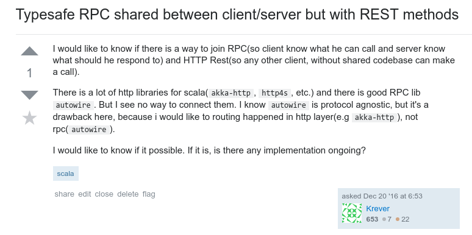
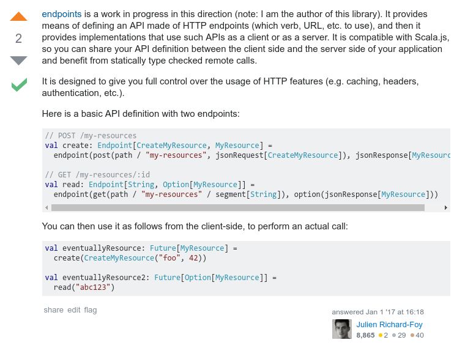
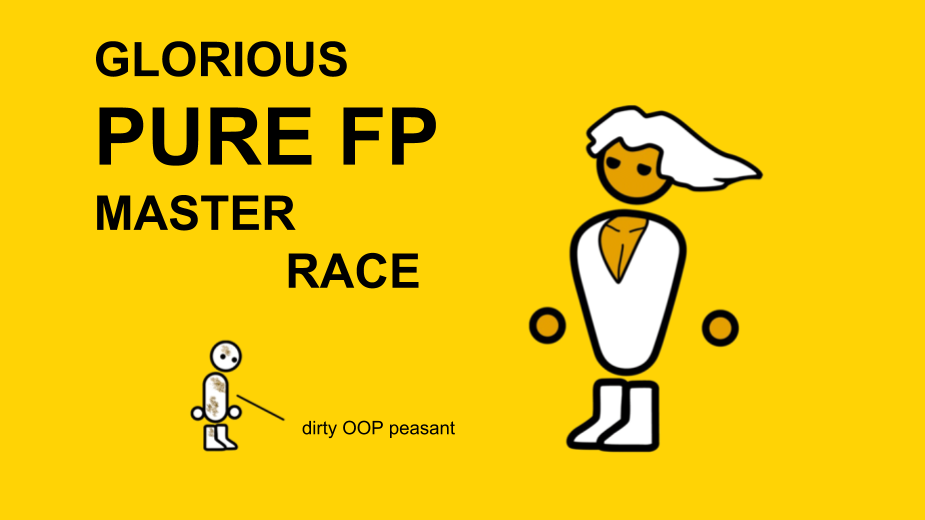

## OBJECT ALGEBRAS
#### AND WHY YOU WON'T TOUCH
# HTTP LIBRARY
#### EVER AGAIN

<span style="color:gray; font-size:0.6em;">Wojtek Pituła @ Sony Electronics</span>

----

### The boss

 <!-- .element: style="border: none; box-shadow:none;" -->

++++

<!-- -- .section: data-transition="" -->
We need a new API!

 <!-- .element: style="border: none; box-shadow:none;" -->

++++

<!-- -- .section: data-background="black" data-transition="fade" -->

<pre><code data-trim data-noescape class=scala>
val route =
    <span data-fragment-index="1" class="fragment highlight-current-bg">path("users" / "search") {
        parameters('name) { name =>
            get {</span>
              complete(<span data-fragment-index="2" class="fragment highlight-current-bg">service.findUser(name)</span>)
            }
        }
    }
</code></pre>

<pre><code data-trim data-noescape class=scala>
case class User(name: String)

trait Service {
    def findUser(name: String): <span data-fragment-index="2" class="fragment highlight-current-bg">Future[Option[User]]</span>
}
</code></pre>

++++

We need a frontend!

 <!-- .element: style="border: none; box-shadow:none;" -->

++++

<!-- JS client - intro -->
<!-- -- .section: data-background="black" data-transition="fade" -->

<pre><code data-trim data-noescape class=scala>
def <span data-fragment-index="1" class="fragment highlight-current-bg">findUser(name: String, callback: Option[User] => Unit)</span>: Unit = {
    val xhr = new XMLHttpRequest()
    xhr.open(<span data-fragment-index="2" class="fragment highlight-current-bg">"GET"</span>,
      s"http://localhost<span data-fragment-index="2" class="fragment highlight-current-bg">/users/search?name=$name"</span>
    )
    xhr.onload = { (e: Event) =>
      if (xhr.status == 200) {
        val json = <span data-fragment-index="2" class="fragment highlight-current-bg">JSON.parse(xhr.responseText)</span>
        val user = <span data-fragment-index="2" class="fragment highlight-current-bg">decodeUser(json)</span>
        <span data-fragment-index="3" class="fragment highlight-current-bg">callback(Some(user))</span>
      } else if(xhr.status == 404) {
        callback(None)
      }
    }
    xhr.send()
}
</code></pre>

++++

We need a client!

 <!-- .element: style="border: none; box-shadow:none;" -->

++++

<!-- -- .section: data-background="black" data-transition="fade" -->

<pre><code data-trim data-noescape class=scala>
def <span data-fragment-index="1" class="fragment highlight-current-bg">findUser(name: String): Future[Option[User]]</span> =
    sttp
      .<span data-fragment-index="2" class="fragment highlight-current-bg">get</span>(uri"https://localhost<span data-fragment-index="2" class="fragment highlight-current-bg">/user/search?name=$name</span>")
      .response(<span data-fragment-index="2" class="fragment highlight-current-bg">asJson[User]</span>)
      .send()
      .map{
        case resp if <span data-fragment-index="3" class="fragment highlight-current-bg">resp.isSuccess</span> => Some(resp.unsafeBody)
        case resp if <span data-fragment-index="3" class="fragment highlight-current-bg">resp.code == 404</span> => None
      }
</code></pre>

++++

We need docs!

 <!-- .element: style="border: none; box-shadow:none;" -->

++++

<!-- -- .section: data-background="black" data-transition="none" 1-->
<div style=font-size:70%>
<pre><code data-trim data-noescape class=yml>
openapi: "3.0.0"
info:
  title: Users API
  version: v1
paths:
  <span class="fragment highlight-current-bg" data-fragment-index="1">/user/search</span>:
    <span class="fragment highlight-current-bg" data-fragment-index="1">get</span>:
      summary: Search for user
      operationId: usersSearch
      parameters:
        - name: <span class="fragment highlight-current-bg" data-fragment-index="1">name</span>
          in: query
          description: Name of the user
          required: true
          schema:
            type: string
      responses:
        '200':
          description: An paged array of pets
          content:
            <span class="fragment highlight-current-bg" data-fragment-index="1">application/json</span>:
              schema:
                $ref: <span class="fragment highlight-current-bg" data-fragment-index="1">"#/components/schemas/Users"</span>
        '404':
          description: User not found
</code></pre>
</div>

++++

<div style="font-size:200%">
<b>
<span class=fragment>DO</span>
<span class=fragment>NOT</span>
<span class=fragment>REPEAT</span>
<span class=fragment>YOURSELF</span>
</b></div>

<div class=fragment>


</div>

++++

<!-- what you do when you have a problem? -->



++++



----

# Endpoints

++++

### API

<pre><code data-trim data-noescape class=scala>
package shared
import endpoints.algebra
import io.circe.generic.JsonCodec

trait UsersApi extends
  <span class="fragment highlight-current-bg">algebra.Endpoints
  with algebra.OptionalResponses
  with algebra.circe.JsonEntitiesFromCodec</span> {

  <span class="fragment highlight-current-bg">def usersSearch: Endpoint[String, Option[User]]</span> =
    <span class="fragment highlight-current-bg">endpoint(
        get(path / "users" / "search" /? qs[String]("name")),
        option(jsonResponse[User])
    )</span>
}

@JsonCodec
case class User(name: String)
</code></pre>

++++

### Server

<pre><code data-trim data-noescape class=scala>
package server

import shared.UsersApi
import endpoints.akkahttp.server
import akka.http.scaladsl.server.Route

class UsersApiRoutes(service: Service)
    <span class="fragment highlight-current-bg">extends shared.UsersApi</span>
    <span class="fragment highlight-current-bg">with server.Endpoints
    with server.OptionalResponses
    with server.JsonEntitiesFromCodec</span> {

    <span class="fragment highlight-current-bg">val routes: Route = usersSearch
        .implementedByAsync(name => service.findUser(name))</span>
}
</code></pre>

<pre><code data-trim data-noescape class=scala>
<span class="fragment highlight-current-bg">val api = new UsersApiRoutes(new Service)
Http().bindAndHandle(api.routes, "localhost", 8080)</span>
</code></pre>

++++

### Client 
<pre><code data-trim data-noescape class=scala>
package client

import shared.UsersApi
import endpoints.scalaj

class UsersApiClient(address: String)
    <span class="fragment highlight-current-bg">extends shared.UsersApi</span>
    <span class="fragment highlight-current-bg">with scalaj.Endpoints
    with scalaj.OptionalResponses
    with scalaj.JsonEntitiesFromCodec</span> {

}
</code></pre>

<pre><code data-trim data-noescape class=scala>
val client = new UsersApiClient("http://localhost:8080")
<span class="fragment highlight-current-bg">val userOpt: Option[User] = 
  client.usersSearch.call("Bob") </span>
</code></pre>

++++

### Docs
<div style="font-size: 80%">
<pre><code data-trim data-noescape class=scala>
import endpoints.documented

trait MyApiDocumented
 <span class="fragment highlight-current-bg" data-fragment-index="1" > extends documented.algebra.Endpoints
    with documented.algebra.JsonSchemaEntities
    with documented.generic.JsonSchemas</span> {

  def usersSearch: Endpoint[String, Option[User]] =
    endpoint(
        get(path / "users" / "search" /? qs[String]("name")),
        option(
            jsonResponse[User] (<span class="fragment highlight-current-bg" data-fragment-index="2">documentation = "User with given name"</span>)
            <span class="fragment highlight-current-bg" data-fragment-index="2">notFoundDocumentation = "User not found"</span>
        )
    )
  <span class="fragment highlight-current-bg" data-fragment-index="3">implicit lazy val userJsonSchema: JsonSchema[User] = genericJsonSchema</span>
}
</code></pre>
</div>

++++

### Docs
<div style="font-size: 80%">
<pre><code data-trim data-noescape class=scala>
import endpoints.documented.openapi
import endpoints.documented.openapi.model.{Info, OpenApi}

object MyApiOpenApi
  <span class="fragment highlight-current-bg">extends MyApiDocumented
    with openapi.Endpoints
    with openapi.JsonSchemaEntities</span> {

  val api: OpenApi =
    <span class="fragment highlight-current-bg">openApi(
      Info(title = "API to search for users ", version = "1.0.0")
    )(usersSearch)</span>

}
</code></pre>
<pre><code data-trim data-noescape class=scala>
<span class="fragment highlight-current-bg">import io.circe.syntax._
val docs = MyApiOpenApi.api.toJson</span>
</code></pre>
</div>

++++

### Simple, isn't it?

* single endpoint definition <!-- .element: class="fragment" -->
* server provides only business logic <!-- .element: class="fragment" -->
* client & docs for free <!-- .element: class="fragment" -->
* typesafe & macro-free <!-- .element: class="fragment" -->

++++

### Current status

<table>
  <tbody>
    <tr>
      <th>Server</th>
      <th>Client</th>
      <th>Other</th>
    </tr>
    <tr>
      <td style="vertical-align:top">
        <ul>
          <li>akka-http</li>
          <li>play</li>
        <ul>
      </td>
      <td style="vertical-align:top">
        <ul>
          <li>akka-http</li>
          <li>play</li>
          <li>scalaj</li>
          <li>XHR</li>
        <ul>
      </td>
      <td style="vertical-align:top">
        <ul>
          <li>circe</li>
          <li>play-json</li>
          <li>open api</li>
        <ul>
      </td>
    </tr>
  </tbody>
</table>

++++


++++

### Future/Help wanted

<table>
  <tbody>
    <tr>
      <th>Server</th>
      <th>Client</th>
      <th>Other</th>
    </tr>
    <tr>
      <td style="vertical-align:top">
        <ul>
          <li>http4s</li>
        <ul>
      </td>
      <td style="vertical-align:top">
        <ul>
          <li>sttp</li>
          <li>rosHTTP</li>
          <li>free monad</li>
        <ul>
      </td>
      <td style="vertical-align:top">
        <ul>
          <li>compatibility check</li>
          <li>scala-native</li>
          <li>boilerplate-free crud</li>
        <ul>
      </td>
    </tr>
  </tbody>
</table>

++++

### Alternatives

* swagger-codegen/thrift/protobuf <!-- .element: class="fragment" -->
* autowire/remotely/Lagom <!-- .element: class="fragment" -->
* fintrospect/rho <!-- .element: class="fragment" -->

----

## Object Algebras ... 
#### <span class=fragment>... sort of<span>

++++



notes:
I kind of like OOP
maybe stockholm syndrome?
tagless final + inheritance

++++

### Algebra

Just basic vocabulary

```scala
trait RequestBodies {
    type Body[T]

    def emptyBody: Body[Unit]
    def stringBody: Body[String]
    def wwwFormBody: Body[Map[String, Seq[String]]]
}
```

++++

```scala
trait Requests extends RequestBodies with Urls {
    type Request[T]

    def request[U, B](url: Url[U],
                      body: Body[B]): Request[(U, B)]
}
```

```scala
trait Endpoints extends Requests with Responses {
    type Endpoint[Req, Resp]

    def endpoint[Req, Resp](
        request: Request[Req],
        response: Response[Resp]
    ): Endpoint[Req, Resp]
}
```

++++

### Interpreter

```scala
// Play
trait RequestBodiesInterpreter extends RequestBodies {
    type Body[T] = play.api.mvc.BodyParser[T]

    def wwwFormBody: Body[Map[String, Seq[String]]] = 
      BodyParsers.parse.formUrlEncoded
}
```
<div class=fragment>
<pre><code data-trim data-noescape class=scala>
// Akka
trait ServerInterpreter extends Endpoints {
  type Response[A] = A => Route

  def textResponse: Response[String] = body => 
    Directives.complete((StatusCodes.OK, body))
}
</code></pre>
</div>

++++

### Usage

```scala
trait MyApi extends Endpoints {
  val stringToInt: Endpoint[String, Int] = 
    endpoint(
      post(path / "convertString", textRequest),
      intResponse
    )
}
```
```scala
trait MyApiServer extends MyApi with ServerInterpreter {

}
```

++++

### Extensibility

++++

#### deliver partial interpreter 

```scala
trait JsonEntities extends Requests {
  //typeclass 
  type JsonRequest[A]
  
  def jsonRequest[A : JsonRequest]: RequestBody[A]
}
```

```scala
trait CirceSupport extends JsonEntities {
  type JsonRequest[A] = 
    (io.circe.Decoder[A], io.circe.Encoder[A]])
}
```

++++

#### add custom vocabulary 

Or implement missing interpreter

```scala
trait MyApi extends ... {

  val stringToInt: Endpoint[String, Either[MyError, Int]] = 
    endpoint(
      post(path / "convertString", textRequest),
      validated(intResponse)
    )

  def validated[A](response: Response[A]): Response[Either[MyError, A]]
}
```

++++

#### fix a bug / modify the behaviour

```scala
trait MyServerInterpreter extends ... {

  override def get[...](...) = ...

}
```

++++

### Tagless final and free

Object Algebras = Tagless Final + Inheritance

[Free vs Tagless Final](https://softwaremill.com/free-tagless-compared-how-not-to-commit-to-monad-too-early/)

++++

#### Composition over inheritance?

<!-- one of my first questions was: why not composition? -->

<div style="font-size:80%">

<p align="center" class="fragment">
all interpreters must agree on the same type members implementations
</p>

<p align="center" class="fragment">
&darr; <br/>
SI-5712: class constructors doesn't work with dependent types
</p>

<p align="center" class="fragment">
&darr; <br/>
all type members must become type arguments
</p>

<p align="center" class="fragment">
&darr; <br/>
`Endpoints` algebra contains more than 10 type members
</p>

</div>

++++

```scala
trait Endpoints[
    Request[_],
    Response[_],
    RequestHeaders[_],
    RequestBody[_],
    Url[_],
    Segment[_],
    QueryString[_],
    QueryStringParam[_],
    QueryParam[_],
    Path[_],
    ...
]
```


----

## Resources

* [endpoints](https://github.com/julienrf/endpoints)
* [Extensibility for the masses](https://www.cs.utexas.edu/~wcook/Drafts/2012/ecoop2012.pdf)
* [Modular Remote Communication Protocol Interpreters](https://arxiv.org/pdf/1711.09288.pdf)


----

## Don't repeat yourself
#### Thanks!

Wojtek Pituła

[@Krever01](https://twitter.com/Krever01)

[w.pitula.me/presentations](http://w.pitula.me/presentations/scalar-2018/index.html)


