#### Durable Event-Sourced
## <y-ellow>Workflow Monad</y-ellow>
##### Seriously!


<span style="font-size: 0.7em;color: gray">Voytek Pituła</span>

----

<span class="breadcrumb-data">Workflows4s</span>

### A long time ago

<p style="font-size: 0.6em; margin-top: -20px; color: gray">(In 2022)</p>

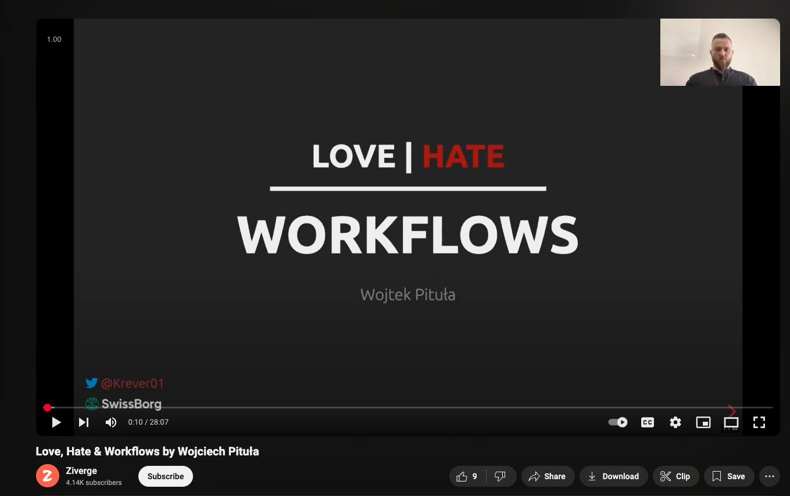

++++

### My <y-ellow>history</y-ellow> with Workflows

<ul style="font-size: .7em">
 <li class="fragment fade-in-then-semi-out">2018 - Camunda <y-ellow>@</y-ellow> Sony</li>
 <li class="fragment fade-in-then-semi-out">2019 - Cadence & Temporal <y-ellow>@</y-ellow> Sony</li>
 <li class="fragment fade-in-then-semi-out">2020 - Event-sourcing <y-ellow>@</y-ellow> SwissBorg</li>
 <li class="fragment fade-in-then-semi-out">Q4 2022 - <y-ellow>Everything is broken</y-ellow></li>
 <li class="fragment fade-in-then-semi-out">Q1 2024 - Kakfa + postgres <y-ellow>@</y-ellow> SwissBorg </li>
 <li class="fragment fade-in-then-semi-out">Q1 2024 - <y-ellow>Workflows4s</y-ellow> prototype</li>
</ul>

----

<span class="breadcrumb-data">Workflows4s » What is a workflow?</span>

## What is a <y-ellow>workflow</y-ellow>?

Steps + State + Time

++++

#### Different names?

<div style="font-size: .7em">

* Long running process
* Business process
* Service orchestration
* Saga
* Finite state machine

</div>

++++

### Examples

<dl style="font-size: .7em">
  <dt class="fragment fade-in-then-semi-out" data-fragment-index="1">Employee Onboarding</dt>
  <dd class="fragment fade-in-then-semi-out" data-fragment-index="1">Sign a contract <i>(Event)</i> → Wait → Create accounts

  <dt class="fragment fade-in-then-semi-out" data-fragment-index="2">Food delivery</dt>
  <dd class="fragment fade-in-then-semi-out" data-fragment-index="2">Order <i>(Event)</i> → Funds Lock → Delivery <i>(Event)</i> → Funds capture </dd>

  <dt class="fragment fade-in-then-semi-out" data-fragment-index="3">Expense Reimbursement</dt>
  <dd class="fragment fade-in-then-semi-out" data-fragment-index="3">Submit expense <i>(Event)</i> → Approval granted <i>(Event)</i> → Funds transfer</dd>
</dl>


++++

### Rings a bell?

🔔🔔🔔

----

<span class="breadcrumb-data">Workflows4s » Why everything is broken?</span>

## Why everything is <y-ellow>broken</y-ellow>?

<span style="font-size: .7em">You don't invent stuff without a good reason</span>

++++

<span class="breadcrumb-data">Workflows4s » Why everything is broken?</span>

### What <y-ellow>goes into</y-ellow> a workflow solution?

* Definition
* Execution
* Monitoring
* Management


++++

<span class="breadcrumb-data">Workflows4s » Why everything is broken?</span>

### What <y-ellow>REALLY</y-ellow> goes into a workflow solution?

* Definition
* Understandability
* Migrations

++++

<span class="breadcrumb-data">Workflows4s » Why everything is broken?</span>

### What's in place?

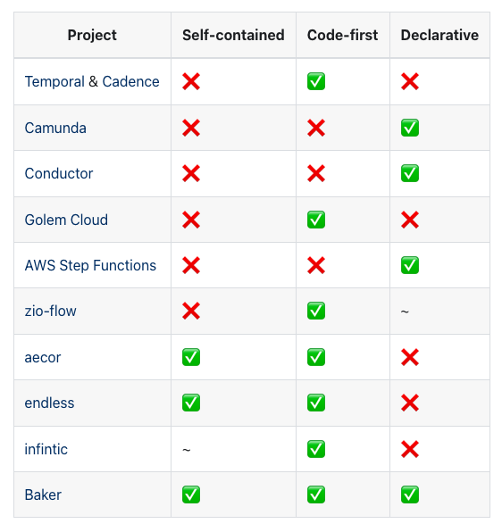

<!--TODO wording, self contained is not a good term -->

++++

<span class="breadcrumb-data">Workflows4s » Why everything is broken? » What's in place?</span>

#### Data workflows are <y-ellow>not</y-ellow> our workflows

Hence, no Airflow & friends

<!--TODO gray -->

----

<span class="breadcrumb-data">Workflows4s » Meet Workflows4s</span>

## <y-ellow>Workflows4s</y-ellow>

<div style="font-size: .7em">

* Composable
* Scalable (up & down)
* Business-friendly
* <y-ellow>LIBRARY</y-ellow>
* Possible only in <y-ellow>Scala</y-ellow>

</div>

----

<span class="breadcrumb-data">Workflows4s</span>

## <y-ellow>Defining</y-ellow> workflows

++++

<span class="breadcrumb-data">Workflows4s » Defining workflows</span>

<pre style="width: fit-content"><code class="hljs scala">sealed trait WIO[In, Err, Out]</code></pre>

++++

<pre style="width: fit-content"><code class="hljs scala">trait WorkflowContext {
  type Event
  type State
}</code></pre>

<pre style="width: fit-content"><code class="hljs scala">sealed trait WIO[In, Err, Out, Ctx <: WorkflowCtx]</code></pre>

++++

<pre style="width: fit-content"><code class="hljs scala">trait WorkflowContext {
  type Event
  type State
}</code></pre>

<pre style="width: fit-content"><code class="hljs scala">sealed trait WIO[In, Err, Out <: Ctx#State, Ctx <: WorkflowCtx]</code></pre>

<span style="font-size: .5em; color: gray">If we still had general type projections</span>

++++

## Is it a <y-ellow>monad</y-ellow>?

Maybe? <!-- .element: class="fragment" -->

++++

<span class="breadcrumb-data">Workflows4s » Defining workflows</span>

## Operations

++++

<span class="breadcrumb-data">Workflows4s » Defining workflows » Operations</span>

### Executing Code

<div class="container">
    <div class="col" style="font-size: 0.7em">
        Pure
        <pre><code class="hljs scala">val doThings: WIO[In, Nothing, Out] =
  WIO
    .pure
    .makeFrom[In]
    .value(input => Out(...))
    .autonamed</code></pre>
    </div>
    <div class="col" style="font-size: 0.7em">
        Impure
        <pre><code class="hljs scala">val doThings: WIO[In, Nothing, Out] =
  WIO
    .runIO[In](input => IO(MyEvent()))
    .handleEvent((input, event) => Out(...))
    .autoNamed</code></pre>
    </div>
</div>

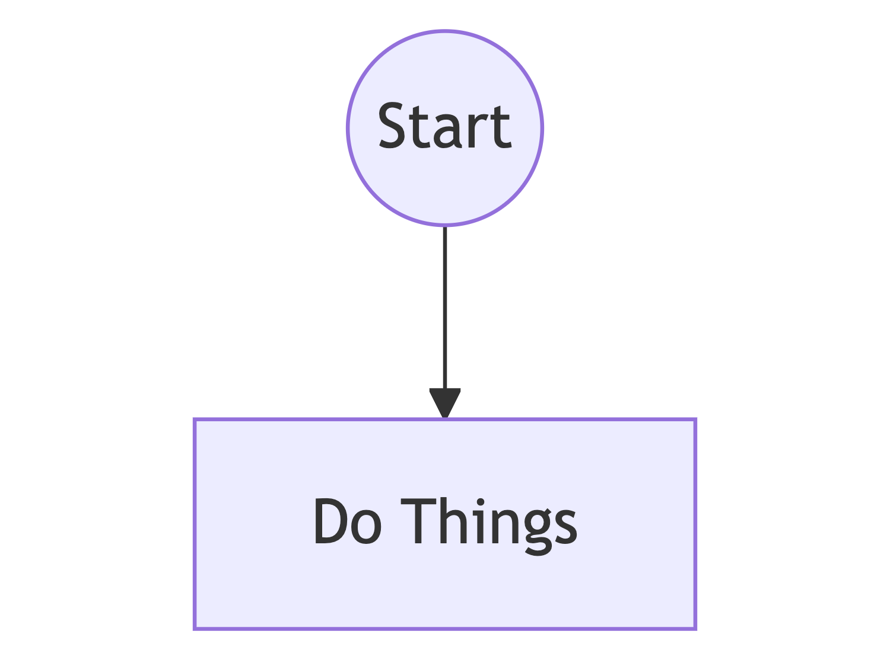

++++

### Sequencing steps

```scala
val step1: WIO[A, Nothing, B] = ???
val step2: WIO[B, Nothing, C] = ???

val sequence1 = step1 >>> step2
```

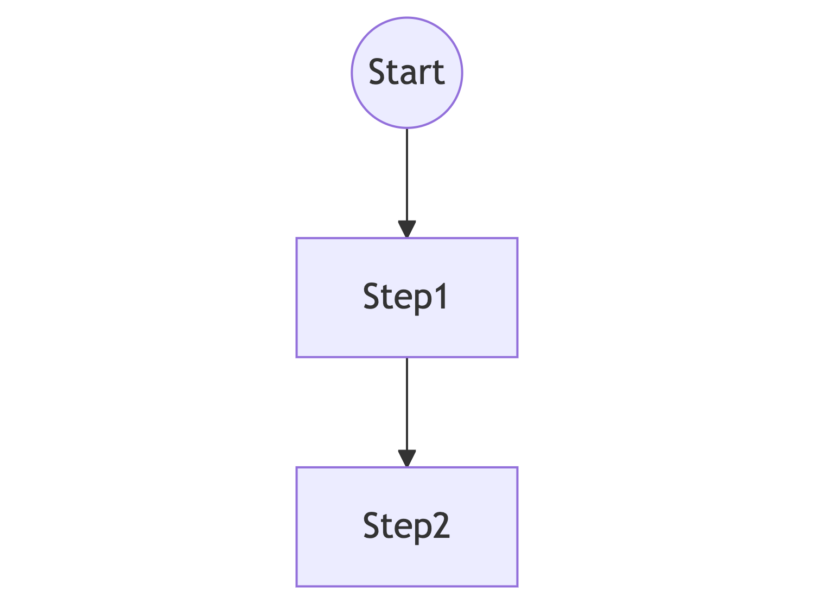

++++

### Sequencing steps

Don't use `.flatMap`

++++

### Signals

```scala [1|5|7-9]
val MySignal = SignalDef[MyRequest, MyResponse]()

val doThings: WIO[MyState, Nothing, MyState] =
  WIO
    .handleSignal(MySignal)
    .using[MyState]
    .withSideEffects((state, request) => IO(MyEvent()))
    .handleEvent((state, event) => state)
    .produceResponse((state, event) => MyResponse())
    .autoNamed
```

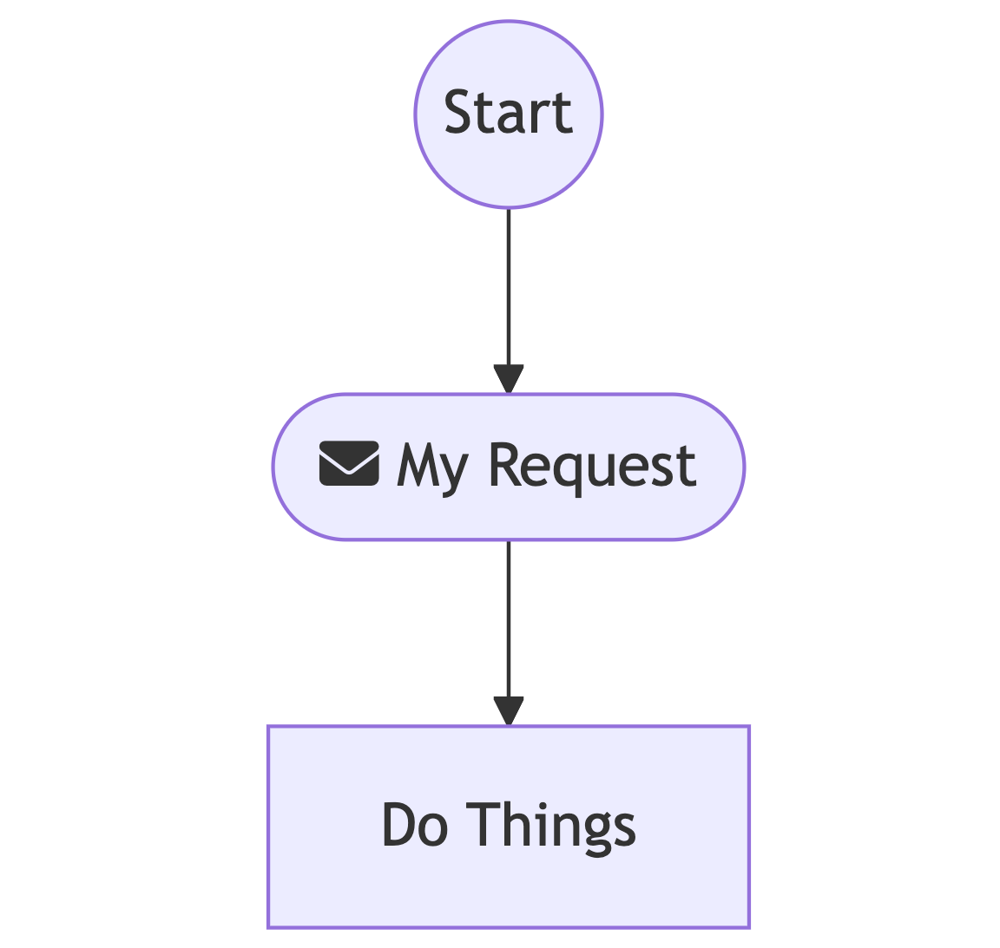

++++

### Timers

```scala
val waitForInput: WIO[MyState, Nothing, MyState] =
  WIO
    .await[MyState](1.day)
    .persistStartThrough(start => MyEvent1(start.at))(evt => evt.time)
    .persistReleaseThrough(release => MyEvent2(release.at))(evt => evt.time)
    .autoNamed
```

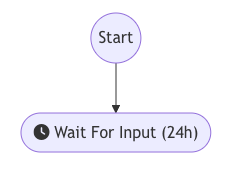

++++

### Error handling

```scala [1|2|4-5]
val doThings: WIO[In, MyError, Out]                        = ???
val handleThatError: WIO[(MyState, MyError), Nothing, Out] = ???

val errorHandled: WIO[In, Nothing, Out] = 
  doThings.handleErrorWith(handleThatError)
```

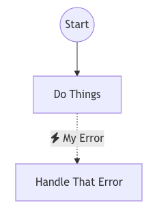

++++

### Interruptions

<div class="container">
    <div class="col">

<pre style="font-size: .3em; width: fit-content"><code class="hljs scala">val MySignal = SignalDef[MyRequest, MyResponse]()
val doA      = WIO.pure(MyState(1)).autoNamed
val doB      = WIO.pure(MyState(1)).autoNamed

val interruption =
  WIO.interruption
    .throughSignal(MySignal)
    .handleSync((state, request) => MyEvent())
    .handleEvent((state, event) => MyState(0))
    .produceResponse((state, event) => MyResponse())
    .autoNamed()
    .andThen(_ >>> doB)

val interruptedThroughSignal = doA.interruptWith(interruption)</code></pre>

</div>
<div class="col">
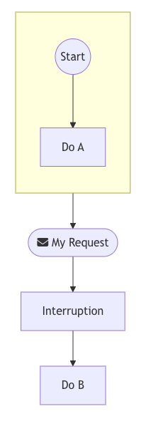
</div>
</div>

++++

### More?

* Forks
* Loop
* Parallel paths
* Embedding sub-workflows

++++

### Drafts

<div class="container fragment">
<div class="col" style="font-size: .6em">

```scala
val createPR: WIO.Draft    = WIO.draft.signal()
val runPipeline: WIO.Draft = WIO.draft.step(error = "Critical Issue")
val awaitReview: WIO.Draft = WIO.draft.signal(error = "Rejected")

val mergePR: WIO.Draft = WIO.draft.step()
val closePR: WIO.Draft = WIO.draft.step()

val workflow: WIO.Draft = (
  createPR >>>
    runPipeline >>>
    awaitReview >>>
    mergePR
).handleErrorWith(closePR)
```

</div>
<div>
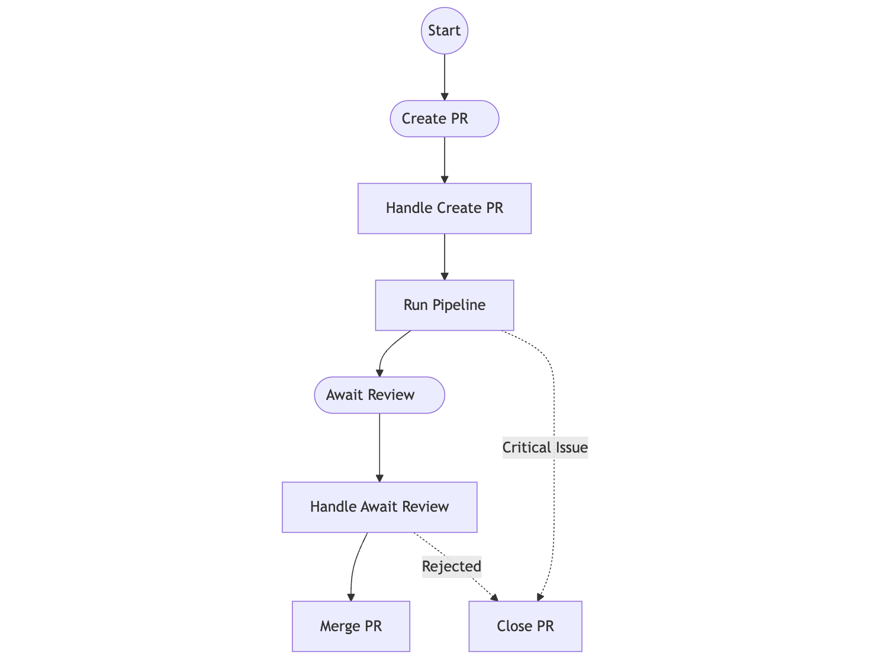
</div>

</div>

++++

### Direct style?

----

<span class="breadcrumb-data">Workflows4s</span>

## <y-ellow>Running</y-ellow> workflows

++++

<span class="breadcrumb-data">Workflows4s » Running workflows</span>

```scala
trait WorkflowRuntime[F[_], Ctx <: WorkflowContext, WorkflowId]{
    def createInstance(id: WorkflowId):
       F[WorkflowInstance[F, WCState[Ctx]]]
}
```

++++

<span class="breadcrumb-data">Workflows4s » Running workflows</span>

```scala [1|3|5-8|10|12]
trait WorkflowInstance[F[_], State] {

  def queryState(): F[State]

  def deliverSignal[Req, Resp](
    signalDef: SignalDef[Req, Resp], 
    req: Req
  ): F[Either[UnexpectedSignal, Resp]]

  def wakeup(): F[Unit]

  def getProgress: F[WIOExecutionProgress[State]]
}
```

++++

<span class="breadcrumb-data">Workflows4s » Running workflows</span>

```scala [1|2|3]
val myWorkflow: WIO[Any, Nothing, WCState[Ctx], Ctx] = ???
val runtime = SomeRuntime.create(wio) // simplified
val instance = runtime.createInstance(id)
```

++++

## Available Runtimes

* In Memory <!-- .element: class="fragment fade-in-then-semi-out yellow" -->
* Pekko <!-- .element: class="fragment fade-in-then-semi-out yellow" -->
* Postgres <!-- .element: class="fragment fade-in-then-semi-out yellow" -->
* SQLite <!-- .element: class="fragment fade-in-then-semi-out yellow" -->

++++

## Knocker-Uppers

* Sleeping <!-- .element: class="fragment fade-in-then-semi-out yellow" -->
* Quartz <!-- .element: class="fragment fade-in-then-semi-out yellow" -->
* Filesystem <!-- .element: class="fragment fade-in-then-semi-out yellow" -->

----

## Visualization

++++

<span class="breadcrumb-data">Workflows4s » Visualization</span>

### BPMN 

<div style="font-size: .7em">

```scala
val wio: WIO[?, ?, ?, ?] = ???
val bpmnXML              = BPMNConverter.convert(wio.toProgress.toModel, "process")
```

</div>

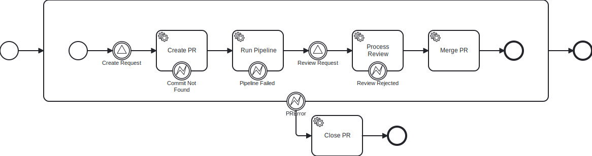


++++

### Mermaid

<div style="font-size: .7em">

```scala
val wio: WIO[?, ?, ?, ?] = ???
val mermaidString        = MermaidRenderer.renderWorkflow(wio.toProgress)
```

</div>

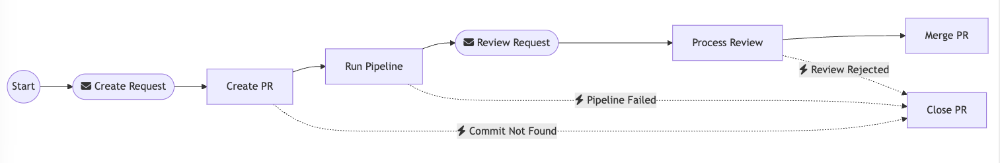

++++

### Progress tracking

<div class="container">
<div class="col" style="font-size: .7em;">

```scala
val instance: WorkflowInstance[?, ?] = ???
val mermaidString = MermaidRenderer
    .renderWorkflow(instance.getProgress)
```

</div>
<div class="col">
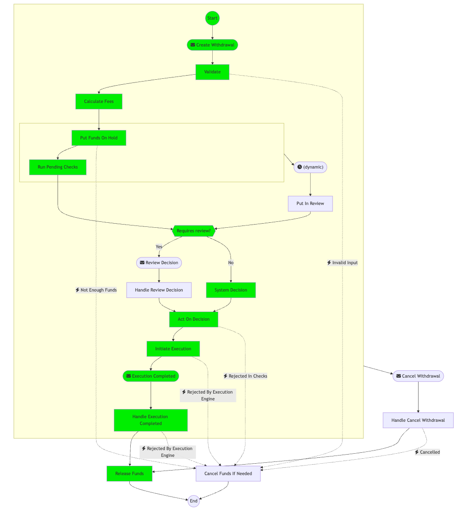
</div>
</div>


++++

### Debugging

```text
 [Sequence](no-name) 
  - step 0: [HandleError](no-name) 
    - base: [Sequence](no-name) 
      - step 0: [Interruptible](no-name) 
        - base: [Sequence](no-name) 
          - step 0: [HandleSignal](Validate) Executed: Initiated(abc,100,Iban(A))
          - step 1: [RunIO](Calculate Fees) Executed: Validated(abc,100,Iban(A),Fee(11))
          - step 2: [RunIO](Put Funds On Hold) Executed: Validated(abc,100,Iban(A),Fee(11))
          - step 3: [Pure](no-name) 
          - 5 more steps
        - trigger: [HandleSignal](no-name) Signal: Cancel Withdrawal
      - 1 more steps
    - handler: [RunIO](Cancel Funds If Needed) 
  - 1 more steps
```

++++

### <y-ellow>Web UI</y-ellow> Coming!

----

<span class="breadcrumb-data">Workflows4s</span>

## <y-ellow>Workflows4s</y-ellow>

<div style="font-size: .7em">

* Composable
* Scalable (up & down)
* Business-friendly
* <y-ellow>LIBRARY</y-ellow>
* Possible only in <y-ellow>Scala</y-ellow>

</div>

++++

<span class="breadcrumb-data">Workflows4s » Key Properties</span>

### Composable

- Definitions
- Sub-workflows

++++

### Scalable

- Runtimes
- Knocker-uppers
- Sub-workflows
- Drafts

++++

### Business-friendly

- Visualizations
- Progress tracking

++++

### Library

- No server
- No scaffolding

++++

### Possible only in <y-ellow>Scala</y-ellow>

- Akka/Pekko
- Culture of IOs
- Language features

----

<span class="breadcrumb-data">Workflows4s</span>

### Is it production ready?

> Everything is production ready if you're brave enough

++++

### What's still missing?

* Polishing <!-- .element: class="fragment fade-in-then-semi-out" -->
* Workflow evolution strategy <!-- .element: class="fragment fade-in-then-semi-out" -->
* USAGE ATTEMPTS! <!-- .element: class="fragment fade-in-then-semi-out" -->

----

## More?

- [Love, Hate & Workflows](https://www.youtube.com/watch?v=jLN1ibwUwuY)
- [Workflows4s Docs](https://business4s.org/workflows4s/)
- [Workflows4s DevLog](https://www.youtube.com/@Business4scalaHQ)

----

### There is <y-ellow>hope</y-ellow> 

<hr style="width:100%;height:0.15em;background-color: #eee;">
<div style="font-size: 0.7em">
Thank you!

Voytek Pituła @ SwissBorg

[w.pitula.me/presentations](https://w.pitula.me/presentations)
</div>
