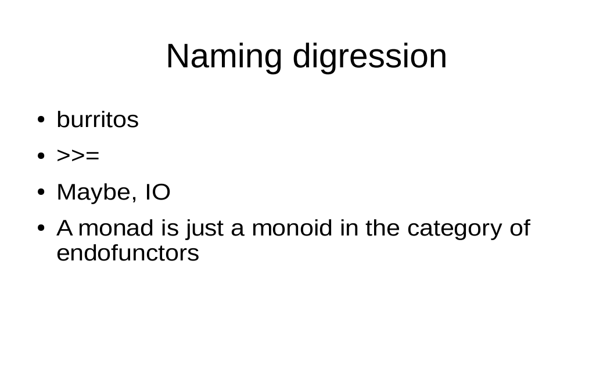
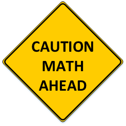

# It's just a monoid in category of endofunctors

<span style="color:gray; font-size:0.6em;">Wojciech Pituła @ Nordea Data Engineering</span>


Note:
Who have seen this phrase before?

+++



+++


+++


+++


+++


+++



---

## <span style="color: red">Monad</span> is a <span style="color: red">monoid</span> in category of endo<span style="color: red">functors</span>

Note:
Who know these terms?

+++

### Monad

```scala
trait Monad[F[_]] {
  def unit[A](value: A): F[A]
  
  def bind[A, B](instance: F[A], f: A => F[B]): F[B]
}
```

+++

### Monad example

```scala
object OptionMonad extends Monad[Option] {
  def unit[A](value: A) = Some(a)
  
  def bind[A, B](instance: Option[A], f: A => Option[B]): Option[B] = 
    instance match {
      case Some(value) => f(value)
      case None => None
    }
}
```


+++

### Monoid

```scala
trait Monoid[F] {
  def zero: F
  def combine(a: F, b: F): F
}
```

+++

### Monoid examples

```scala
object IntAddMonoid extends Monoid[Int] {
  def zero: Int = 0
  def combine(a: Int, b: Int): Int = a + b
}
```
```scala
object IntMultiplyMonoid extends Monoid[Int] {
  def zero: Int = 1
  def combine(a: Int, b: Int): Int = a * b
}
```

+++

### Functor

```scala
trait Functor[F[_]] {
    def map[A, B](instance: F[A], f: A => B): F[B]
}
```

+++

### Functor example

```scala
object OptionFunctor extends Functor[Option] {
    def map[A, B](instance: Option[A], f: A => B): Option[B] =
      instance match {
        case Some(value) => Some(f(value))
        case None => None
      }
}
```

---

## Monad is a monoid <span style="color: red">in category</span> of endofunctors


+++

### Category

```scala
trait Category {
  type Morphism[F, G]
}
```

```scala
object CategoryOfSets extends Category {
  type Morphism[F, G] = F => G
}
```

+++
### Monoidal category

```scala
trait MonoidalCategory {
  type Morphism[F, G]
  type MonoidalProduct[F,G]
  type IdentityObject
}

```

+++
### Monoidal category example

```scala
object CategoryOfSets extends MonoidalCategory {
  type Morphism[F, G] = F => G
  type MonoidalProduct[F,G] = (F, G)
  type IdentityObject = Unit
}
```

+++
### Monoid in category

```scala
trait MonoidInCategory[F] {

  type Category <: MonoidalCategory
  
  def zero: Category#Morphism[Category#IdentityObject, F]
  
  def combine: Category#Morphism[Category#MonoidalProduct[F,F], F]
  
}
```

```scala
trait MonoidInCategoryOfSets[T] extends MonoidInCategory[T] {
  type Category = CategoryOfSets
  def zero: Unit => T
  def combine: ((T, T)) => T
}
```

+++
### Example

```scala
object IntAddMonoidInCategoryOfSets extends MonoidInCategoryOfSets[Int] {
    def zero: Unit => Int = (a: Unit) => 0 
    def combine: ((Int, Int)) => Int = (t: (Int, Int)) => t._1 + t._2
}
```

---
## Monad is a monoid in category of <span style="color: red">endo</span>functors


+++
### Endofunctor

Just a functor we know

```scala
trait Functor[F[_]] {
    def map[A, B](instance: F[A], f: A => B): F[B]
}
```

+++
### Category of different kind

```scala
trait Product[F[_], G[_]] {
  type Out[T]
}

trait MonoidalCategoryK2 {
  type Morphism[F[_], G[_]]
  type MonoidalProduct[F[_],G[_]] <: Product[F, G]
  type IndentityObject[T]
}
```

+++
### Preparation

```scala
case class Id[T](value: T)

trait NaturalTransformation[F[_], G[_]] {
  def apply[A](fa: F[A]): G[A]
}

type ~~>[-F[_], +G[_]] = NaturalTransformation[F, G]

trait Compose[F[_], G[_]] extends Product[F,G]{
  type Out[T] = F[G[T]]
}
```

+++
### Examples

```scala
object TryToOption extends NaturalTransformation[Try, Option] {
  def apply[T](t: Try[T]): Option[T] = t.toOption
}

val x: Compose[Option, Try]#Out[Int] = Option(Try(1))
val y: Option[Try[Int]] = Option(Try(1))
}
```

+++
### Category of Endofunctors

```scala
trait CategoryOfEndofunctors extends MonoidalCategoryK2{

  type Morphism[F[_], G[_]] = NaturalTransformation[F, G]
  
  type MonoidalProduct[F[_],G[_]] = Compose[F,G]
  
  type IndentityObject[T] = Id[T]
}
```

+++
### Monoid in category of endofunctors

```scala
trait MonoidInCategoryOfEndofunctors[F[_]] extends MonoidInCategoryK2[F] {
  type Category = CategoryOfEndofunctors
  def zero: Id ~~> F
  def combine: Compose[F,F]#Out ~~> F
  def functor: Functor[F]
}
```


+++
### Option Monoid

```scala
object OptionMonoid extends MonoidInCategoryOfEndofunctors[Option] {
  override def zero: Id ~~> Option = new NaturalTransformation[Id, Option]{
    def apply[T](id: Id[T]): Option[T] = Some(id.value)
  }

  override def combine: Compose[Option,Option]#Out ~~> Option = 
    new NaturalTransformation[Compose[Option,Option]#Out, Option]{
      def apply[T](opt: Option[Option[T]]): Option[T] = opt.flatten
    }

  override def functor: Functor[Option] = OptionFunctor
}
```

---
## Monad <span style="color: red">is a</span> monoid in category of endofunctors

+++
### How to prove it?

```scala
def fromMonoidToMonad[M[_]]
  (monoid: MonoidInCategoryOfEndofunctors[M]): Monad[M]
```

```scala
def fromMonadToMonoid[M[_]]
  (monad: Monad[M[_]]): MonoidInCategoryOfEndofunctors[M]
```

+++
### From monoid to monad
```scala
def fromMonoidToMonad[M[_]](monoid: MonoidInCategoryOfEndofunctors[M]): Monad[M] = {
  new Monad[M]{
    override def unit[A](v: A): M[A] = monoid.zero(Id(v))
    override def bind[A, B](m: M[A], f: (A) => M[B]): M[B] = 
      monoid.combine(monoid.functor.fmap(f)(m))
  }
}
```

+++
From monad to monoid
```scala
def fromMonadToMonoid[M[_]](monad: Monad[M]): MonoidInCategoryOfEndofunctors[M] = {
  new MonoidInCategoryOfEndofunctors[M] {
    override def zero: Id ~~> M = new (Id ~~> M) {
      override def apply[A](a: Id[A]): M[A] = monad.unit(a.value)
    }
    
    override def combine: Compose[M, M]#Out ~~> M = new (Compose[M, M]#Out ~~> M) {
      override def apply[A](m: M[M[A]]): M[A] = monad.bind(m, identity[M[A]])
    }
    
    override def functor: Functor[M] = new Functor[M] {
      override def fmap[A, B](f: (A) => B): (M[A]) => M[B] = (m: M[A]) => {
        monad.bind(m, f.andThen(monad.unit))
      }
    }
  }
}
```

---

## Summary

- We intentionally ignored all the laws, because it`s boring
- Category theory is not *that* scary
- We can prove things with code
- Scala type system is nice

---

## Questions ?

- [@Krever01](https://twitter.com/Krever01)
- [w.pitula.me](http://w.pitula.me)

