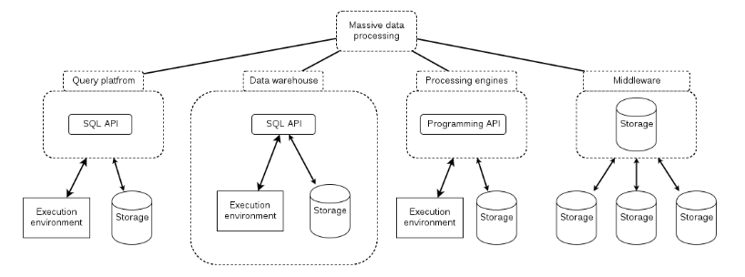
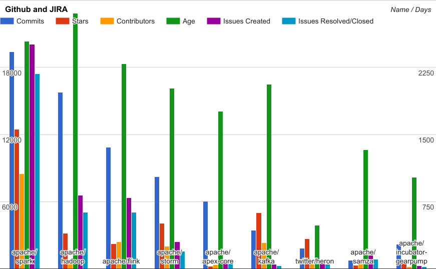
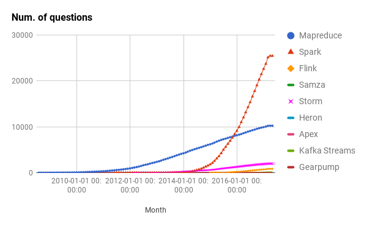

Master thesis

## Comparison of modern platforms for massive data processing

Author: Wojciech Pituła

Supervisor: dr. hab. inż. Paweł Czarnul

The Department of Computer Architecture

----

## Problems

1. What platforms should be compared?
1. What aspects and features should be compared?
1. How to gather the data?
1. What are the results?

----

### What platforms should be compared?

++++

### Market research

++++

### Platforms classifications

++++

### Platforms representatives

++++

### End result

* processing engines
* actively maintained
* open-source

++++

### Platforms list

<table>
  <tbody>
    <tr>
      <th>Batch</th>
      <th>Stream</th>
    </tr>
    <tr>
      <td valign="top" style="vertical-align: top">
        <ul>
          <li>Hadoop MapReduce</li>
          <li>Apache Spark</li>
          <li>Apache Flink</li>
          <li>Apache Apex</li>
        </ul>
      </td>
      <td>
        <ul>
          <li>Apache Spark</li>
          <li>Apache Flink</li>
          <li>Apache Apex</li>
          <li>Apache Storm</li>
          <li>Twitter Heron</li>
          <li>Apache Samza</li>
          <li>Kafka Streams</li>
          <li>Apache Gearpump</li>
        </ul>
      </td>
    </tr>
  </tbody>
</table>

----

### What aspects and features should be compared?

++++

### 4 distinct perspectives

theoretical 

processing paradigm, complexity, generality, message-delivery guarantees, performance <!-- .element: style="font-size: 20" -->

developer's 

supported languages, API abstraction level, typesafety, advanced features <!-- .element: style="font-size: 20" -->

operations' 

execution environment, monitoring, GPU support, security <!-- .element: style="font-size: 20" -->

manager's 

popularity, maturity, licensing, enterprise support <!-- .element: style="font-size: 20" -->

++++

### End result

* 36 trenary features
* numeric metrics: maturity, popularity

----

### How to gather the data?

* documentation
* word-count implementations
* limited benchmark executed on real cluster(AWS)
* metrics from Stackoverflow, Google, git, issue trackers

----

### What are the results?

++++

### Example 1: Processing model

<table>
  <tbody>
    <tr>
      <th align="left" ></th>
      <th align="center">Batch</th>
      <th align="center">Batch-as-stream</th>
      <th align="center">Micro-batching</th>
      <th align="center">Direct message processing</th>
    </tr>
    <tr>
      <th align="left" >MapReduce</th>
      <td align="center">&#x2611;</td>
      <td align="center"></td>
      <td align="center"></td>
      <td align="center"></td>
    </tr>
    <tr>
      <th align="left" >Apache Samza</th>
      <td align="center"></td>
      <td align="center"></td>
      <td align="center"></td>
      <td align="center">&#x2611;</td>
    </tr>
    <tr>
      <th align="left" >Apache Spark</th>
      <td align="center">&#x2611;</td>
      <td align="center"></td>
      <td align="center">&#x2611;</td>
      <td align="center">coming</td>
    </tr>
    <tr>
      <th align="left" >Apache Flink</th>
      <td align="center"></td>
      <td align="center">&#x2611;</td>
      <td align="center"></td>
      <td align="center">&#x2611;</td>
    </tr>
    <tr>
      <th align="left" >Kafka Streams</th>
      <td align="center"></td>
      <td align="center"></td>
      <td align="center"></td>
      <td align="center">&#x2611;</td>
    </tr>
    <tr>
      <th align="left" >Apache Gearpump</th>
      <td align="center"></td>
      <td align="center"></td>
      <td align="center"></td>
      <td align="center">&#x2611;</td>
    </tr>
    <tr>
      <th align="left" >Apache Storm</th>
      <td align="center"></td>
      <td align="center"></td>
      <td align="center">&#x2611;</td>
      <td align="center">&#x2611;</td>
    </tr>
    <tr>
      <th align="left" >Twitter Heron</th>
      <td align="center"></td>
      <td align="center"></td>
      <td align="center"></td>
      <td align="center">&#x2611;</td>
    </tr>
    <tr>
      <th align="left" >Apache Apex</th>
      <td align="center"></td>
      <td align="center">&#x2611;</td>
      <td align="center"></td>
      <td align="center">&#x2611;</td>
    </tr>
  </tbody>
</table>

++++

### Example 2: Languages

<table>
  <tbody>
    <tr>
      <th align="left" ></th>
      <th align="center">Java</th>
      <th align="center">Scala</th>
      <th align="center">Other</th>
    </tr>
    <tr>
      <th align="left" >MapReduce</th>
      <td align="center">&#x2611;</td>
      <td align="center">&#x2612;</td>
      <td align="center">Any, via Hadoop Streaming</td>
    </tr>
    <tr>
      <th align="left" >Apache Samza</th>
      <td align="center">&#x2611;</td>
      <td align="center">&#x2612;</td>
      <td align="center"></td>
    </tr>
    <tr>
      <th align="left" >Apache Spark</th>
      <td align="center">&#x2611;</td>
      <td align="center">&#x2611;</td>
      <td align="center">Python, R</td>
    </tr>
    <tr>
      <th align="left" >Apache Flink</th>
      <td align="center">&#x2611;</td>
      <td align="center">&#x2611;</td>
      <td align="center"></td>
    </tr>
    <tr>
      <th align="left" >Kafka Streams</th>
      <td align="center">&#x2611;</td>
      <td align="center">&#x2612;</td>
      <td align="center"></td>
    </tr>
    <tr>
      <th align="left" >Apache Gearpump</th>
      <td align="center">&#x2611;</td>
      <td align="center">&#x2611;</td>
      <td align="center"></td>
    </tr>
    <tr>
      <th align="left" >Apache Storm</th>
      <td align="center">&#x2611;</td>
      <td align="center">&#x2612;</td>
      <td align="center"></td>
    </tr>
    <tr>
      <th align="left" >Twitter Heron</th>
      <td align="center">&#x2611;</td>
      <td align="center">&#x2612;</td>
      <td align="center"></td>
    </tr>
    <tr>
      <th align="left" >Apache Apex</th>
      <td align="center">&#x2611;</td>
      <td align="center">&#x2612;</td>
      <td align="center"></td>
    </tr>
  </tbody>
</table>

++++

### Example 3: Deployment

<table>
  <tbody>
    <tr>
      <th align="left" ></th>
      <th align="center">Local</th>
      <th align="center">Yarn</th>
      <th align="center">Mesos</th>
      <th align="center">Standalone</th>
      <th align="center">Any/None</th>
    </tr>
    <tr>
      <th align="left" >MapReduce</th>
      <td align="center">&#x2611;</td>
      <td align="center">&#x2611;</td>
      <td align="center">&#x2612;</td>
      <td align="center">&#x2612;</td>
      <td align="center">&#x2612;</td>
    </tr>
    <tr>
      <th align="left" >Apache Samza</th>
      <td align="center">&#x2611;</td>
      <td align="center">&#x2611;</td>
      <td align="center">&#x2612;</td>
      <td align="center">&#x2612;</td>
      <td align="center">&#x2612;</td>
    </tr>
    <tr>
      <th align="left" >Apache Apex</th>
      <td align="center">&#x2611;</td>
      <td align="center">&#x2611;</td>
      <td align="center">&#x2612;</td>
      <td align="center">&#x2612;</td>
      <td align="center">&#x2612;</td>
    </tr>
    <tr>
      <th align="left" >Apache Storm</th>
      <td align="center">&#x2611;</td>
      <td align="center">&#x2612;</td>
      <td align="center">&#x2612;</td>
      <td align="center">&#x2611;</td>
      <td align="center">&#x2612;</td>
    </tr>
    <tr>
      <th align="left" >Twitter Heron</th>
      <td align="center">&#x2611;</td>
      <td align="center">&#x2611;</td>
      <td align="center">&#x2611;</td>
      <td align="center">&#x2612;</td>
      <td align="center">&#x2612;</td>
    </tr>
    <tr>
      <th align="left" >Apache Gearpump</th>
      <td align="center">&#x2611;</td>
      <td align="center">&#x2611;</td>
      <td align="center">&#x2612;</td>
      <td align="center">&#x2611;</td>
      <td align="center">&#x2612;</td>
    </tr>
    <tr>
      <th align="left" >Apache Spark</th>
      <td align="center">&#x2611;</td>
      <td align="center">&#x2611;</td>
      <td align="center">&#x2611;</td>
      <td align="center">&#x2611;</td>
      <td align="center">&#x2612;</td>
    </tr>
    <tr>
      <th align="left" >Apache Flink</th>
      <td align="center">&#x2611;</td>
      <td align="center">&#x2611;</td>
      <td align="center">&#x2611;</td>
      <td align="center">&#x2611;</td>
      <td align="center">&#x2612;</td>
    </tr>
    <tr>
      <th align="left" >Kafka Streams</th>
      <td align="center">&#x2611;</td>
      <td align="center">&#x2611;</td>
      <td align="center">&#x2611;</td>
      <td align="center">&#x2611;</td>
      <td align="center">&#x2611;</td>
      </td>
    </tr>
  </tbody>
</table>

++++

### Example 4: Maturity

++++

### Example 5: Popularity

++++

### End results

<table>
  <tbody>
    <tr>
      <th align="left" ></th>
      <th align="center">Features</th>
      <th align="center">Popularity</th>
      <th align="center">Maturity</th>
      <th align="center">Result</th>
    </tr>
    <tr>
      <th align="left" >Apache Spark</th>
      <td>1.0</td>
      <td>1.0</td>
      <td>0.99</td>
      <td><b>1.0</b></td>
    </tr>
    <tr>
      <th align="left" >Apache Flink</th>
      <td>0.92</td>
      <td>0.07</td>
      <td>0.31</td>
      <td><b>0.43</b></td>
    </tr>
    <tr>
      <th align="left" >Hadoop MapReduce</th>
      <td>0.6</td>
      <td>0.16</td>
      <td>0.45</td>
      <td><b>0.40</b></td>
    </tr>
    <tr>
      <th align="left" >Kafka Streams</th>
      <td>0.92</td>
      <td>0.04</td>
      <td>0.20</td>
      <td><b>0.39</b></td>
    </tr>
    <tr>
      <th align="left" >Apache Storm</th>
      <td>0.81</td>
      <td>0.08</td>
      <td>0.26</td>
      <td><b>0.38</b></td>
    </tr>
    <tr>
      <th align="left" >Apache Apex</th>
      <td>0.81</td>
      <td>0.02</td>
      <td>0.13</td>
      <td><b>0.32</b></td>
    </tr>
    <tr>
      <th align="left" >Tiwtter Heron</th>
      <td>0.68</td>
      <td>0.01</td>
      <td>0.07</td>
      <td><b>0.25</b></td>
    </tr>
    <tr>
      <th align="left" >Apache Samza</th>
      <td>0.60</td>
      <td>0.01</td>
      <td>0.09</td>
      <td><b>0.23</b></td>
    </tr>
    <tr>
      <th align="left" >Apache Gearpump</th>
      <td>0.42</td>
      <td>0.00</td>
      <td>0.07</td>
      <td><b>0.16</b></td>
    </tr>
  </tbody>
</table>

----

### Thank you

