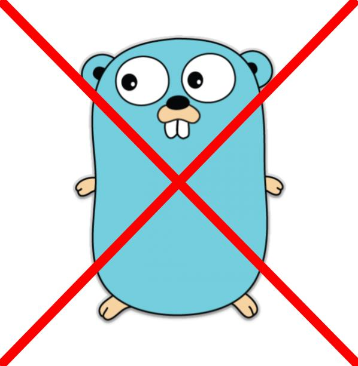

# That's enough, <span style="color: red">bash</span>.
## that's enough.

<span style="color:gray; font-size:0.6em;">Wojtek Pituła @ Sony Electronics</span>

----

<!-- -- .section: data-background="black" -->


++++

<!-- -- .section: data-transition="slide-in none" -->

<table class="comic-table">
    <col width="300">
    <col width="300" align=center>
    <col width="300">
    <tr>
        <td></td>
        <td></td>
        <td></td>
    </tr>
    <tr>
        <td></td>
        <td></td>
        <td></td>
    </tr>
        <tr>
        <td></td>
        <td></td>
        <td></td>
    </tr>
</table>

++++

<!-- -- .section: data-transition="none slide-out" -->

<table class="comic-table">
    <col width="300">
    <col width="300" align=center>
    <col width="300">
    <tr>
        <td></td>
        <td></td>
        <td></td>
    </tr>
    <tr>
        <td></td>
        <td></td>
        <td></td>
    </tr>
        <tr>
        <td></td>
        <td></td>
        <td></td>
    </tr>
</table>

++++

### My story is worse

* week of refactoring bash code <!-- .element: class="fragment" -->
* code without types <!-- .element: class="fragment" -->
* code without tests <!-- .element: class="fragment" -->
* code never meant for long term use <!-- .element: class="fragment" --> 
* code written by people who were far from bash experts <!-- .element: class="fragment" -->
* code that became critical part of the platform <!-- .element: class="fragment" -->

++++

<!-- -- .section: data-background="black" -->

# Explosives are hard to get


++++

# <span style="color: blue" class=blink_me>Ammonite</span>

----

## What is <span style="color: red">Ammonite</span>?

* Ammonite-Ops <!-- .element: class="fragment" -->
* Ammonite-REPL <!-- .element: class="fragment" -->
* Ammonite-Shell <!-- .element: class="fragment" -->
* Scala scripts <!-- .element: class="fragment" -->

++++

<!-- -- .section: data-background="black" -->

<small><b>What is <span style="color: red">Ammonite</span>?</b></small>
### Getting started

```bash
$ sudo sh -c '(echo "#!/usr/bin/env sh" && curl -L https://github.com/lihaoyi/Ammonite/releases/download/1.1.2/2.12-1.1.2) > /usr/local/bin/amm && chmod +x /usr/local/bin/amm' && amm

$ amm
Loading...
Welcome to the Ammonite Repl 1.0.3
(Scala 2.12.4 Java 1.8.0_73)
If you like Ammonite, please support our development at www.patreon.com/lihaoyi

@ (ls! pwd).filter(_.toString.contains("IntelliJ"))
res4: Seq[Path] = List(
  root/'home/'wpitula/".IntelliJIdea2016.3",
  root/'home/'wpitula/".IntelliJIdea2017.1",
  root/'home/'wpitula/".IntelliJIdea2017.2",
  root/'home/'wpitula/".IntelliJIdea2017.3",
  root/'home/'wpitula/".IntelliJIdea2018.1",
  root/'home/'wpitula/".IntelliJIdea2018.2"
)
```


----

## <span style="color: red">bash</span> is awesome!

++++

### Time to market & flexibility matters

```
read-kafka.sh | 
    grep ... | 
    jq ... | 
    awk ...
```

```scala
rdd
  .filter(...)
  .map(...)
  .reduce(...)
```

----

## Whats wrong with <span style="color: red">bash</span>?

----

<small><b>Whats wrong with <span style="color: red">bash</span>?</b></small>
## Arcane syntax

++++

<small><b>Arcane syntax</b></small>
### Arithmetic

```bash
$(($a+$b))
```
```bash
$[$a+$b]
```
```bash
$[a+b]
```

no floats

++++

<small><b>Arcane syntax</b></small>
### parameter expansion

<div style=font-size:70% class=fragment>
<pre><code data-trim data-noescape class=bash>
${parameter:-word}
${parameter:=word}
${parameter:?word}
${parameter:+word}
${parameter:offset}
${parameter:offset:length}
${!prefix*}
${!prefix@}
${!name[@]}
${!name[*]}
${#parameter}
${parameter#word}
${parameter##word}
${parameter%word}
${parameter%%word}
${parameter/pattern/string}
${parameter^pattern}
${parameter^^pattern}
${parameter,pattern}
${parameter,,pattern}
${parameter@operator}
</code></pre></div>

notes:
21 versions

++++

<small><b>Arcane syntax</b></small>
### arrays

```bash
  arr=(a b c d)
  ${arr[*]}         # All of the items in the array
  ${!arr[*]}        # All of the indexes in the array
  ${#arr[*]}        # Number of items in the array
  ${#arr[0]}        # Length of item zero
```

```bash
array=("first item" "second item" "third" "item")

arr=(${array[*]})

arr=("${array[*]}")

arr=("${array[@]}")

for ix in ${!arr[*]}; do echo $ix; done;
```

++++

<small><b>Arcane syntax</b></small>
### boolean tests

<div id=left>

<pre><code data-trim data-noescape class=bash>
[ 2 -gt 1 ]
</code></pre>
<pre><code data-trim data-noescape class=bash>
test 2 -gt 1
</code></pre>
<pre><code data-trim data-noescape class=bash>
[[ 2 > 1 ]]
</code></pre>

</div>

<div id=right class=fragment>
<ul>
<li>20 file tests
<li>6 string tests 
<li>6 arithmetic tests 
<li>7 misc operators 
<li>6 parsing rules
</ul>

</div>

++++

<small><b>Arcane syntax</b></small>
### commands


++++

<small><b>Arcane syntax</b></small>
### commands

a.k.a. memorize the whole world

<div style=font-size:80%>
<pre><code data-trim data-noescape class=bash>
find . -iname \\*.scala -print0 | xargs -0 ls -ls | sort -k5 -r | head -3
</code></pre></div>
vs
```scala
(ls.rec! wd).filter(_.ext == "scala").sortBy(_.size).take(3)
```

notes:
Maxim Novak


++++

## <span style="color: red">scala</span> to the rescue

scala has one of the simplest syntax among popular languages

<small>

* arithmetics: `1+2`
* booleans: `1 > 2`
* arrays: `Array(1,2,3).get(1)`
* api: ide-discoverable

</small>

and you already know it

----

<small><b>Whats wrong with <span style="color: red">bash</span>?</b></small>
## Unsafe

++++

<small><b>UNSAFE</b></small>

### Remove your root

```bash
rm -rf $MY_VAR/
```

<div class=fragment>
<pre><code data-noescape class=scala>
@ root / ""
ammonite.ops.PathError$InvalidSegment: [] is not a valid path segment. Ammonite-Ops does not allow empty path segments If you are dealing with path-strings coming from external sources, use the Path(...) or RelPath(...) constructor calls to convert them.
  ammonite.ops.BasePath$.fail$1(Path.scala:76)
  ammonite.ops.BasePath$.checkSegment(Path.scala:92)
  ammonite.ops.RelPath$.StringPath(Path.scala:204)
  ammonite.$sess.cmd2$.<init>(cmd2.sc:1)
  ammonite.$sess.cmd2$.<clinit>(cmd2.sc)
</code></pre></div>

++++


<small><b>UNSAFE</b></small>

### Implicit working dir

<pre><code data-trim data-noescape class=bash>
java -jar <mark>my.jar</mark>
</code></pre>

<pre class=fragment><code data-trim data-noescape class=bash>
script_loc=$(dirname "$(readlink -f "$0")")
java -jar  <mark>$script_loc/my.jar</mark>
</code></pre>

<div class=fragment>
<small><b><span style="color: red">Ammonite</span></b></small>
<pre><code data-trim data-noescape class=scala>
def %%(commands: String*)<mark>(implicit wd: Path)</mark>
</code></pre></div>

++++

<small><b>UNSAFE</b></small>

### No TYPES

```bash
$ foo=(bar baz)
$ sum=$[foo+1]
$ echo $sum
1
```

++++

<small><b>UNSAFE</b></small>

### Partial script execution

```bash
#script.sh

# ...

sudo rm -rf /etc/resolv.conf
sudo eche "127.0.0.1" > /etc/resolv.conf

# ... wihout set -e it goes on

```

++++

### Good practices

</div>

<div id=left>
<ul>
<li class=fragment>shellcheck
<li class=fragment>functions
<li class=fragment>set -o errexit
<li class=fragment>set -o nounset
<li class=fragment>set -o xtrace
<li class=fragment>set -o pipefail
</ul>

</div>

</div id=right>

<h1 class=fragment style="color:red">NO ONE CARES</h1>

</div>

----

<small><b>Whats wrong with <span style="color: red">bash</span>?</b></small>
## Portability

* how to declare dependencies? <!-- .element: class="fragment" -->
* how to get those dependencies? <!-- .element: class="fragment" -->
* how to do this across different OSes? <!-- .element: class="fragment" -->

++++

<small><b><span style="color: red">Ammonite</span></b></small>
### Magic imports

you can use anything available for maven!

```scala
import $ivy.`com.chuusai::shapeless:2.3.2`, shapeless._
```
```scala
import $plugin.$ivy.`org.spire-math::kind-projector:0.6.3`
```
```scala
import $file.myfolder.MyScript
```

----

## What else can we improve?

++++

### Usage docs

<div style=font-size:80%>
<pre><code data-trim data-noescape class=scala>
@main
def command1() = ???

@main
@doc("the best command in the world")
def command2(
  input: Path @doc("awesome output path"),
  overwrite: Boolean @doc("are you brave enough?")
) = ???
</code></pre></div>

<div style=font-size:80%>
<pre><code data-trim data-noescape class=bash>
➜ amm script.sc
Compiling /home/wpitula/IdeaProjects/ammonite-demo/script.sc
Need to specify a subcommand to call when running script.sc

Available subcommands:

  command1

  command2
  the best command in the world
    --input      ammonite.ops.Path: awesome output path
    --overwrite  Boolean: are you brave enough?


</code></pre></div>

++++

#### Built in support for ...
## XML

```scala
val books = <books>
  <book id="b1615">Don Quixote</book>
  <book id="b1867">War and Peace</book>
</books>

val titles = (books \ "book").map(_.text).toList
// titles: List[String] = List(Don Quixote, War and Peace)
```

++++

#### Built in support for ...
## JSON

```scala
val json = ujson.read("""{ "foo": "bar" }""")

val foo = json("foo").str
// foo: String = "bar"
```

++++

#### Built in support for ...
## HTTP

```scala
import scalaj.http._

val body = Http(s"http://example.com").asString.body
val titleLine = body.lines.filter(_.contains("title")).next()
// titleLine: String = "    <title>Example Domain</title>"
```


++++

#### Built in support for ...
## file ops

```scala
import ammonite.ops._

val out = pwd / "x"

mkdir! out

val sources = (ls.rec! pwd).filter(_.ext == "scala")

sources.foreach{file =>
  val newFile = out / file.relativeTo(pwd)
  mkdir! newFile / up
  cp(file, newFile)
}
```

++++

### Other features

* REPL <!-- .element: class="fragment" -->
* emabddable <!-- .element: class="fragment" -->
* watch and reload <!-- .element: class="fragment" -->
* reasonably fast <!-- .element: class="fragment" -->

----

## DEMO


new intellij project
setup worksheets


write hello world, run it with --watch


find book by title
download cover, save to file


----

#### Bonus
# <span style="color: red">Mill</span>

++++

## build tool created in ~3 months

standing on the shoulders of giatns

* ammonite
* coursier

++++

## Everything is a task

* (almost) everything is a task
* each task is cached

```scala
object foo extends ScalaModule { ... }

def lineCount = T {
  import ammonite.ops._
  foo.sources()
    .flatMap(ref => ls.rec(ref.path))
    .filter(_.isFile)
    .flatMap(read.lines)
    .size
}
```
```
$ mill lineCount
3
```

++++

### Super extensible

```scala
object foo extends ScalaModule with ScalafmtModule {
    ...
    override def compile = T {
      reformat()
      super.compile()
    }
}

```

```
$ mill foo.compile
```

++++

## Everything is a module

build matrix
* tests are a separate module
* js/jvm are separate modules
* 2.12/2.13 are separate modules

```
$ mill foo[2.12].js.test.run
```

++++

## Everything is watched

Mill's <span style="color: red">--watch</span> flag watches both the <span style="color: red">files you are building</span> using Mill, 
as well as <span style="color: red">Mill's own build.sc</span>

```
$ mill --watch foo.compile
```


----

<!-- -- .section: data-background="black" -->

## Please,
# <span style="color: red">Don't</span> write <span style="color: red">bash</span>

#### Thanks!

<small>Wojtek Pituła - [@Krever01](https://twitter.com/Krever01)

[w.pitula.me/presentations](http://w.pitula.me/presentations/scalar-2018/index.html)
</small>


